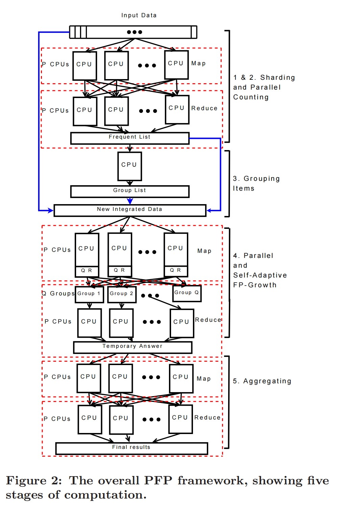

## 频繁模式挖掘
### 刘皓蓝

参考资料：

[
频繁模式挖掘（Frequent Pattern Mining)
](https://blog.csdn.net/weixin_56516468/article/details/121479149)

[
【数据挖掘】频繁模式挖掘及Python实现
](https://blog.csdn.net/weixin_56516468/article/details/121479149)

[
并行FP-Growth算法分析
](https://blog.csdn.net/weixin_40532625/article/details/116047701)

[
并行FP-growth算法
](https://blog.csdn.net/yuankeLi/article/details/104599903)

### 背景介绍

频繁模式挖掘（Frequent Pattern Mining)是数据挖掘中很常用的一个种挖掘，今天给大家介绍的一种名叫Apriori的频繁模式挖掘算法。先来看看什么叫频繁模式？~就是经常一起出现的模式，这里的“模式”是一个比较抽象的概念，我们来看一个具体的例子，那就是著名的“啤酒与尿布”的故事~说是在美国有婴儿的家庭中，一般都是母亲在家中照看婴儿，年轻的父亲前去超市购买尿布。父亲在购买尿布的同时，往往会顺便为自己购买啤酒，这样就会出现啤酒与尿布这两件看上去不相干的商品经常会出现在同一个购物篮的现象。如果这个年轻的父亲在卖场只能买到这两件商品之一，则他很有可能会放弃购物而到另外一家商店，直到可以一次同时购买到啤酒和尿布为止。沃尔玛发现这一独特的现象，开始在卖场尝试将啤酒与尿布摆放在相同的区域，让年轻的父亲可以同时找到这两件商品，并很快地完成购物；而沃尔玛超市也可以让这些客户一次购买到两件商品，而不是一件，从而获得了很好的商品销售收入，这就是“啤酒与尿布”故事的由来。再比如在超市的销售记录里，常常会发现牛奶和面包是经常被一起购买的，那么牛奶和面包这两个item经常一起现在销售记录中，所以在这里牛奶和面包是一个可以看成是一个频繁模式，当然单独看牛奶，单独看面包，也是频繁模式。


### 算法

#### apriori算法

3.1算法概述

       Apriori算法是布尔关联规则挖掘频繁项集的原创性算法，该算法使用频繁项集性质的先验知识。Apriori使用一种称作逐层搜索的迭代方法，k项集用于探索(k+1)项集。首先，通过扫描数据库，累积每个项（数据集不重复的元素)的计数，并收集满足最小支持度的项，找出频繁1项集的集合，并将集合记作L1。然后，L1用于找频繁2项集的集合L2，L2用于找L3，如此迭代，直到不能再找到频繁k项集。找每个Lk需要一次数据库全扫描。
3.2实现原理

        算法实现过程分为两步，一步是连接，一步是剪枝。

        输入：项集I，事务数据集D，最小支持度计数阈值Min_sup

        输出：D中的所有频繁项集的集合L。

        实现步骤：

        (1)求频繁1项集L1 首先通过扫描事务数据集D，找出所有1项集并计算其支持度，作为候选1项集C1 然后从C1中删除低于最小支持度阈值Min_sup的项集，得到所有频繁1项集的集合L1 。

        (2)For k=2,3,4，分别得到L2、L3、L4...Lk。

        (3)连接：将Lk-1进行自身连接生成候选k项集的集合Ck，连接方法如下：对于任意p,q∈Lk-1，若按字典序有p={p1,p2,…,pk-2,pk-1}, q={p1,p2,…,pk-2,qk-1},且满足pk-1<qk-1,则把p和q连接成k项集   {p1,p2,…,pk-2,pk-1,qk-1}作为候选k项集Ck中的元素。

        (4)剪枝：删除Ck中的非频繁k项集，即当Ck中一个候选k项集的某个k-1项子集不是Lk-1中的元素时，则将它从Ck中删除。

        (5)计算支持数：通过扫描事务数据集D，计算Ck中每个k项集的支持数。

        (6)求Lk：删除Ck中低于最小支持度阈值Min_sup的k项集，得到所有频繁k项集的集合Lk。         
        (7)若Lk=Ø，则转第(9)步

        (8)END FOR

        (9)另L=L1∪L2∪…∪Lk，并输出L。

#### FP-Growth算法

FP-growth算法是基于Apriori原理的，通过将数据集存储在FP(Frequent Pattern)树上发现频繁项集，但不能发现数据之间的关联规则。FP树是一种存储数据的树结构，如右图所示，每一路分支表示数据集的一个项集，数字表示该元素在某分支中出现的次数。


#### PFP算法

PFP算法基于FP-growth算法原理，将挖掘数据集的任务分配在多个计算机上，每个计算机相互独立并行的计算与通信。
直接使用FP-growth算法所占内存的使用和计算成本代价过大，瓶颈主要在与建立FP树和计算FP树上的频繁项集上，因此这里是PFP算法主要利用分布式优化的地方
PFP算法实现数据量和挖掘速度呈线性关系，适合用于数据量大的数据集，本pj采用该算法



流程概述
1.	使用wordcouont的经典算法统计词频
2.	利用词频构建一个合理分配算力的哈希规则
3.	利用第2步所使用的的哈希规则选择合适的前缀进行数据的切分，在reduce中使用切分的数据分别构建FP树运算得到结果
4.	将第3步得到的结果按照自己的需求进行聚合修饰

FP树简介
1. 注意到出现次数小于阈值的词语肯定是没有用的，首先统计词频，将每一个句子中的词汇去重，删去词频低于阈值的词。并按照词频排序
2. 建立一棵Trie树，并且使用链表记录把每个词语再Trie树上出现的位置串联起来
3. 按照词频最小到大的统计这个词出现的频繁模式，统计的方法就是重新建立和这个词相关的字典树，按照阈值进行统计


PFP算法详解

1. 使用wordcouont的经典算法统计词频
2. 利用词频构建一个合理分配算力的哈希规则
3. 利用第2步所使用的的哈希规则选择合适的前缀进行数据的切分，在reduce中使用切分的数据分别构建FP树运算得到结果
4. 将第3步得到的结果按照自己的需求进行聚合修饰


代码如下：
```python
from pyspark.ml.fpm import FPGrowth
from pyspark.sql import SparkSession
from pyspark.sql.functions import udf
from pyspark.sql.types import StringType

# 设置SparkSession的master参数为yarn
spark = SparkSession.builder.appName("FPGrowth").master("yarn").getOrCreate()

data = spark.read.text("/user/root/input/data_hanlp")
transactions = data.rdd.map(lambda line: (line.value.strip().split(' '),)).toDF(["items",])

fpGrowth = FPGrowth(itemsCol="items", minSupport=4e-6, minConfidence=0.4)
model = fpGrowth.fit(transactions)

answer = model.associationRules

def str_to_arr(my_list):
    my_list.sort()
    return  '+'.join([str(elem) for elem in my_list])

str_to_arr_udf = udf(str_to_arr, StringType())
answer = answer.withColumn("antecedent", str_to_arr_udf(answer["antecedent"]))
answer = answer.withColumn("consequent", str_to_arr_udf(answer["consequent"]))
answer.write.mode('overwrite').option("header",True).csv("/user/root/output/res_hanlp")

spark.stop()
```

结果表格如下（示例）：

|antecedent|consequent|confidence|lift|support|
|---|---|---|---|---|
|Editi+牛津+第七版+英+词典+高阶|Learner|1.0|110000.0|9.090909090909091E-6|
|Editi+牛津+第七版+英+词典+高阶|Oxford|1.0|110000.0|9.090909090909091E-6|
|Editi+牛津+第七版+英+词典+高阶|th|1.0|40740.74074074074|9.090909090909091E-6|
|Editi+牛津+第七版+英+词典+高阶|s|1.0|1378.4461152882207|9.090909090909091E-6|
|Editi+牛津+第七版+英+词典+高阶|Advanced|1.0|73333.33333333333|9.090909090909091E-6|
|Editi+牛津+第七版+英+词典+高阶|Dictionary|1.0|110000.0|9.090909090909091E-6|
|中心+研究|专利|0.6666666666666666|15602.836879432625|1.6363636363636363E-5|
|中心+研究|信息|0.6666666666666666|652.4317912218268|1.6363636363636363E-5|
|中心+研究|发展|0.6666666666666666|778.485491861288|1.6363636363636363E-5|
|中心+研究|广州市|0.6666666666666666|2546.2962962962965|1.6363636363636363E-5|
|取名字+宝宝|男|0.5|461.40939597315435|5.4545454545454545E-6|
|DjeK+mp3+wWw+俱乐部+更新+混音+珠海|免费|1.0|119.83876239241746|5.4545454545454545E-6|
|DjeK+mp3+wWw+俱乐部+更新+混音+珠海|下载|1.0|40.73319755600815|5.4545454545454545E-6|
|DjeK+mp3+wWw+俱乐部+更新+混音+珠海|格式|1.0|1011.9595216191352|5.4545454545454545E-6|
|DjeK+mp3+wWw+俱乐部+更新+混音+珠海|NeT|1.0|183333.33333333334|5.4545454545454545E-6|